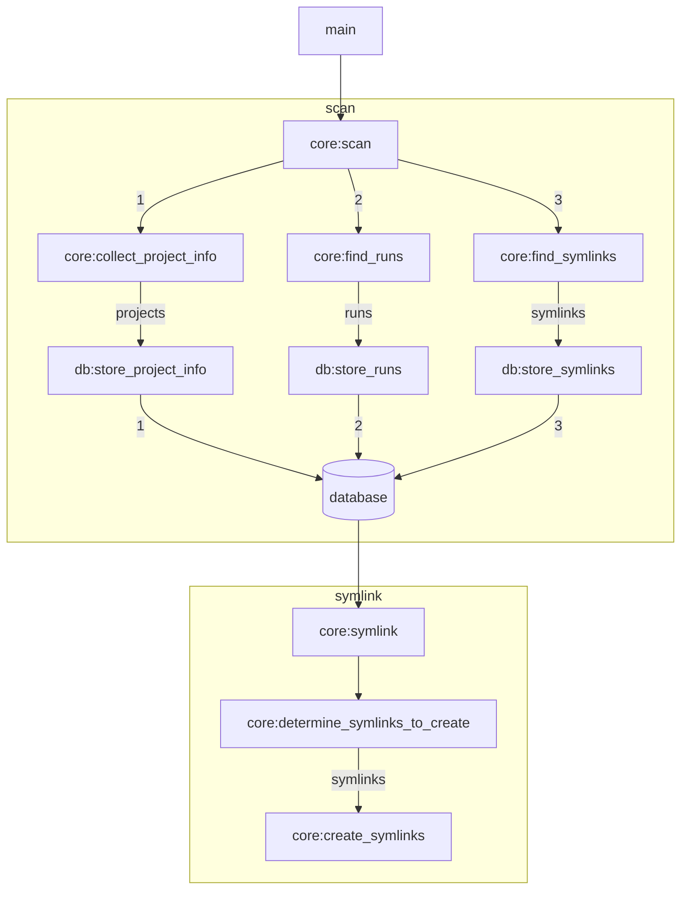

# auto-fastq-symlink
Automated symlinking of illumina fastq files, organized by project.

## Configuration

The config file is `.json` format with the following structure:

```json
{
    "run_parent_dirs": [
        "/path/to/sequencers/M00123/runs",
        "/path/to/sequencers/M00456/runs",
        "/path/to/sequencers/VH00123/runs"
    ],
    "projects_definition_file": "/path/to/projects.csv",
    "scan_interval_seconds": 2,
    "database_connection_uri": "sqlite:///symlinks.db",
    "fastq_extensions": [
        ".fastq",
        ".fastq.gz",
        ".fq",
        ".fq.gz"
    ]
}
```

Each of the `run_parent_dirs` will be scanned for illumina sequencing run output directories.
Both MiSeq and NextSeq output directories are supported, and the directory type will automatically be determined based on the format of the run output directory name.

The `projects_definition_file` is a `.csv` file with the following fields:

- `project_id`
- `fastq_symlinks_dir`
- `excluded_runs_list`
- `excluded_libraries_list`

```csv
project_id,fastq_symlinks_dir,excluded_runs_list,excluded_libraries_list
routine_testing,/path/to/routine_testing/fastq_symlinks_by_run,/path/to/routine_testing_excluded_runs.csv,/path/to/routine_testing_excluded_libraries.csv
assay_development,/path/to/assay_development/fastq_symlinks_by_run,/path/to/assay_development_excluded_runs.csv,/pat/to/assay_development_excluded_libraries.csv
```

Both the `excluded_runs_list` and the `excluded_libraries_list` are simple plaintext files with a single column and no header. Each line is an identifier for a run or a library, respectively, which will be excluded from symlinking for that project.

```csv
sample-01
badsample
sample-238
```

```csv
220803_M00123_0314_000000000-AGH1C
220822_M00456_0218_000000000-A65GM
```


## Application Flowchart

The application cycles between two phases:

1. Scan
Information is collected from all available runs, and stored to the database.
Information on all of the currently-existing symlinks are also collected and stored to the database.

2. Symlink
Based on the state of the database, we determine which symlinks need to be created, and we create them.

The application then pauses for the amount of time defined under the `scan_interval_seconds` config value, then repeats.

If the application is interrupted (via `Ctrl-c`), it will complete a full scan & symlink cycle before exiting.

