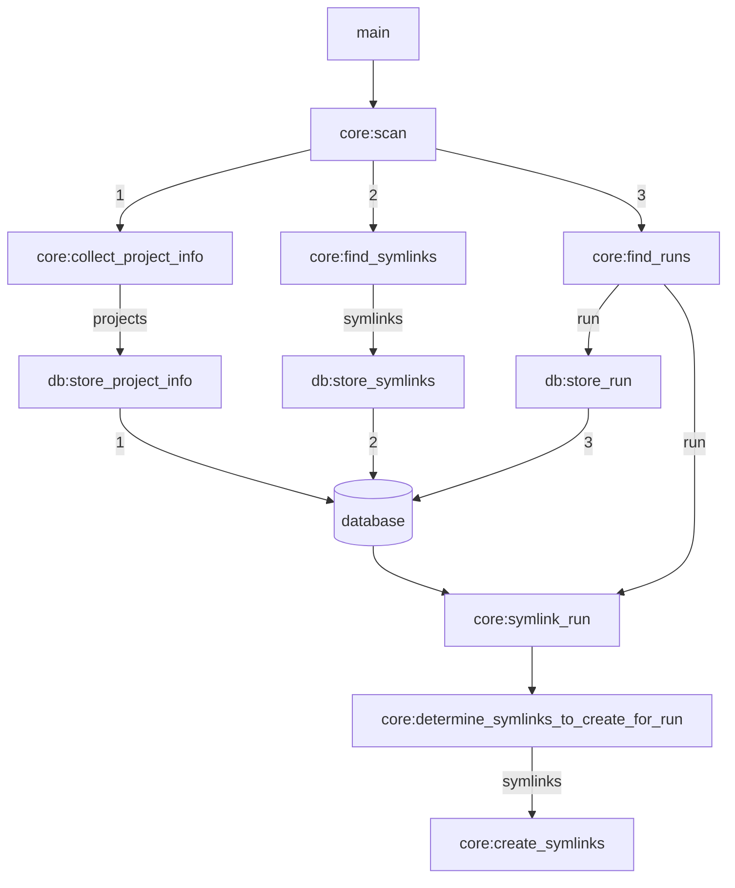

[](https://github.com/BCCDC-PHL/auto-fastq-symlink/actions/workflows/unit_tests.yml)

# auto-fastq-symlink
Automated symlinking of illumina fastq files, organized by project.

## Configuration

The config file is `.json` format with the following structure:

```json
{
    "run_parent_dirs": [
        "/path/to/sequencers/M00123/runs",
        "/path/to/sequencers/M00456/runs",
        "/path/to/sequencers/VH00123/runs"
    ],
    "projects_definition_file": "/path/to/projects.csv",
    "scan_interval_seconds": 2,
    "database_connection_uri": "sqlite:///symlinks.db",
    "fastq_extensions": [
        ".fastq",
        ".fastq.gz",
        ".fq",
        ".fq.gz"
    ]
}
```

Each of the `run_parent_dirs` will be scanned for illumina sequencing run output directories.
Both MiSeq and NextSeq output directories are supported, and the directory type will automatically be determined based on the format of the run output directory name.

The `projects_definition_file` is a `.csv` file with the following fields:

- `project_id`
- `fastq_symlinks_dir`
- `excluded_runs_list`
- `excluded_libraries_list`
- `simplify_symlink_filenames`

```csv
project_id,fastq_symlinks_dir,excluded_runs_list,excluded_libraries_list,simplify_symlink_filenames
routine_testing,/path/to/routine_testing/fastq_symlinks_by_run,/path/to/routine_testing_excluded_runs.csv,/path/to/routine_testing_excluded_libraries.csv,True
assay_development,/path/to/assay_development/fastq_symlinks_by_run,/path/to/assay_development_excluded_runs.csv,/pat/to/assay_development_excluded_libraries.csv,False
```

Both the `excluded_runs_list` and the `excluded_libraries_list` are simple plaintext files with a single column and no header. Each line is an identifier for a run or a library, respectively, which will be excluded from symlinking for that project.

```csv
sample-01
badsample
sample-238
```

```csv
220803_M00123_0314_000000000-AGH1C
220822_M00456_0218_000000000-A65GM
```

If the value for the `simplify_symlink_filenames` field is set to `True` (or one of these: `true`, `T`, `t` or `1`), then the symlinks will be renamed to include only the library ID, followed by `_R1.fastq.gz` or `_R2.fastq.gz`. This feature is useful when symlinking to the illumina fastq files that the sequencers produce, which include additional run-specific tags in the filename (like: `mylibrary_S23_L001_R1_001.fastq.gz`, etc.). If the `simplify_symlink_filenames` field is set to `False` (or one of these: `false`, `F`, `f` or `0`), then the filenames of the symlinks will match the filenames of the target files.

### Project ID Translation

It may be the case that we don't want to use the exact project IDs that were provided in the SampleSheet files, or we want to translate a set of SampleSheet project IDs into a single project for symlinking.
If that is the case, an optional config entry can be added under the key `"project_id_translation_file"`, as shown below.

```json
{
    "run_parent_dirs": [
        "/path/to/sequencers/M00123/runs",
        "/path/to/sequencers/M00456/runs",
        "/path/to/sequencers/VH00123/runs"
    ],
    "projects_definition_file": "/path/to/projects.csv",
    "project_id_translation_file": "/path/to/project_id_translation.csv",
    "scan_interval_seconds": 2,
    "database_connection_uri": "sqlite:///symlinks.db",
    "fastq_extensions": [
        ".fastq",
        ".fastq.gz",
        ".fq",
        ".fq.gz"
    ]
}
```
The `project_id_translation.csv` file should be a csv-formatted file with the headers:

- `samplesheet_project_id`
- `symlinking_project_id`

For example, the following file will translate both `14` and `r_and_d` into `research_and_development`. It will translate `28` into `outbreak_investigation`.

```csv
samplesheet_project_id,symlinking_project_id
14,research_and_development
r_and_d,research_and_development
28,outbreak_investigation
```

**Note:** The `symlinking_project_id` should appear in the `project_id` field of the `projects_definition_file`.

## Application Flowchart

The application cycles between two phases:

1. **Load config**

The config file is loaded, then the `project_definition_file` listed in the config file is loaded, then the exclusion lists that are listed in the project definition file are also loaded. The projects are loaded to the database.

2. **Find and cleanup symlinks**

All of the existing symlinks in any project's `fastq_symlinks_dir` are loaded into the database. Then, all symlinks in the database are checked to see if they exist on the filesystem. If they don't exist, then they are removed from the database.

3. **Find, store and symlink runs**

Look through all of the `run_parent_dirs` listed in the config file, and find any sub-directories that match the standard illumina sequencing run ID format. When a run directory is found:

	1. Determine which type of instrument the run was generated by (MiSeq or NextSeq), and which type of structure the run directory has.
	2. Find and parse the `SampleSheet.csv` file for the run to determine which libraries are on the run, and which project each library belongs to.
	3. Store the info for the run and all of its libraries to the database.
	4. Determine which symlinks need to be created for that run.
	5. Create the symlinks and store them to the database.

The application then pauses for the amount of time defined under the `scan_interval_seconds` config value, then repeats.

If the application is interrupted (via `Ctrl-c`), it will catch the signal and wait for a safe time before exiting (in between runs or before starting a new scan for runs).

This diagram gives a high-level view of the flow of one cycle of the application. It doesn't capture every step. But the names of the methods listed in the diagram do match the actual methods used in the application.



## Testing

Unit tests can be run from the top-level of the source directory as follows:

```
python -m unittest -vv
```

Integration testing can be performed by simulating sequencing runs using [dfornika/illumina-run-simulator](https://github.com/dfornika/illumina-run-simulator). That tool can be configured to simulate realistic `SampleSheet.csv` files and directory structures for both NextSeq and MiSeq files. It can be configured to simulate new runs on a frequent basis (every 5 seconds for example). If the `auto-fastq-symlinker` tool is configured to look at the directories where the `illumina-run-simulator` is writing its output, then it should be able to create symlinks for those simulated runs as they are being simulated.
